# PROYECTO_FINAL_CUSTOMER_CHURN_SQL

## Resumen (Overview)
_Una empresa de telecomunicaciones busca reducir su tasa de abandono de clientes (churn) y mejorar la rentabilidad de su cartera, donde la compañía enfrenta retos críticos en la identificación temprana de clientes en riesgo de fuga, la segmentación ineficiente de su base de usuarios y la falta de visibilidad sobre los patrones de comportamiento que anteceden la cancelación del servicio.
Mi objetivo dentro de SQL Server Management Studio (SSMS) es normalizar y transformar datos transaccionales brutos de clientes en KPIs estratégicos de retención a través de técnicas avanzadas como CTEs, Window Functions y subconsultas correlacionadas._

## Estructura del Proyecto
- [Sobre los Datos](#sobre-los-datos)
- [Habilidades SQL Aplicadas](#habilidades-sql-aplicadas)
- [Tareas](#tareas)
- [Preparación de Datos y Modelado](#preparación-de-datos-y-modelado)
- [Análisis Exploratorio de Datos e Insights (EDA)](#análisis-exploratorio-de-datos-e-insights-eda)
- [Conclusiones Generales](#conclusiones-generales)

---

## Sobre los Datos

El conjunto de datos captura información detallada sobre el comportamiento y perfil de los clientes de una empresa de telecomunicaciones, incluyendo:

- **Perfil del cliente:** Género, edad (Senior Citizen), estado civil (Partner) y dependientes (Dependents).
- **Servicios contratados:** Telefonía, múltiples líneas, internet (DSL / Fibra óptica), seguridad en línea, respaldo en la nube, protección de dispositivos y soporte técnico.
- **Condiciones contractuales:** Tipo de contrato (mensual, anual, bienal), facturación electrónica y método de pago.
- **Métricas de valor:** Antigüedad del cliente en meses (`tenure`), cargo mensual (`MonthlyCharges`) y cargo total acumulado (`TotalCharges`).
- **Variable objetivo:** Indicador binario de churn (`Churn`: Yes / No).

Para mayor información sobre la fuente de datos original puedes encontrarla en este [Link](https://www.kaggle.com/datasets/itszubi/customer-churn-dataset).

El modelo cuenta con una tabla de hechos principal (`Fact_Customers`) y múltiples dimensiones para un análisis granular del comportamiento de deserción.
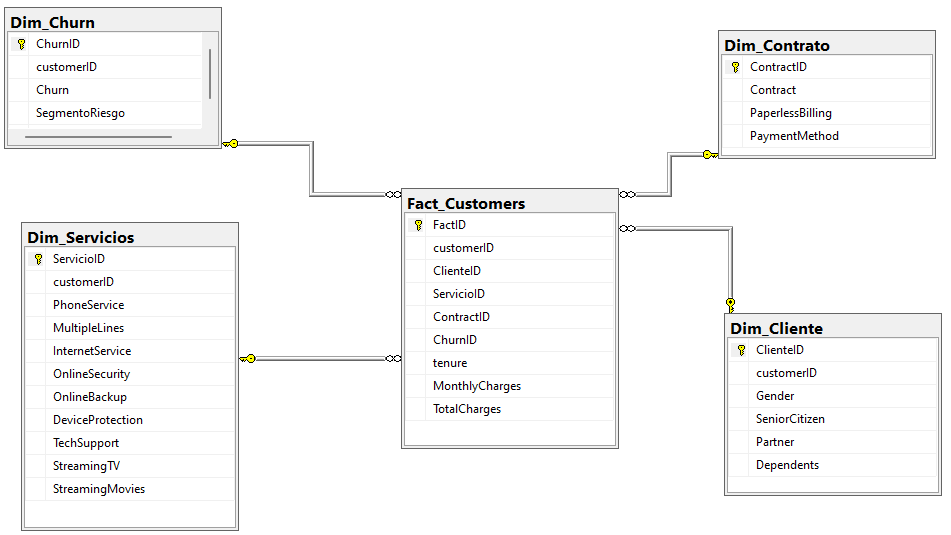

---
## Habilidades SQL Aplicadas

| Categoría | Técnica |
|---|---|
| Modelado | Normalización en esquema estrella, creación de tablas de hechos y dimensiones |
| Transformación | `CAST`, `CASE WHEN`, `ISNULL`, limpieza de nulos en `TotalCharges` |
| Agregación | `GROUP BY`, `HAVING`, `COUNT`, `AVG`, `SUM`, `ROUND` |
| Avanzado | CTEs (`WITH`), Window Functions (`ROW_NUMBER`, `RANK`, `NTILE`, `LAG`) |
| Segmentación | Clasificación ABC de clientes por valor y riesgo, scoring de churn |
| Análisis temporal | Cohortes por `tenure`, horizontes de retención por antigüedad |
| Subqueries | Subconsultas correlacionadas para métricas de comparación |
| Vistas | `CREATE VIEW` para KPIs reutilizables por el equipo de BI |

---
## Tareas (Tasks)

En este análisis, complemento al departamento de Customer Success a responder
lo siguiente, dividido en tres bloques:

### BLOQUE A: Fundamentos de Retención y KPIs de Deserción

1. **Termómetro de Churn Global:** ¿Cuál es la tasa de deserción total de la compañía
y cuánto revenue mensual se pierde por los clientes que abandonaron el servicio?

2. **Radar de Segmentación Contractual:** ¿Cuál es la tasa de churn y el cargo mensual
promedio por tipo de contrato para identificar qué modalidad representa el mayor riesgo
de deserción?

3. **Auditoría de Métodos de Pago:** ¿Qué método de pago concentra la mayor proporción
de clientes con churn y cómo se distribuye el revenue perdido entre cada modalidad
de cobro?

4. **Ranking de Servicios Críticos:** ¿Qué servicios adicionales (soporte técnico,
seguridad en línea, streaming) tienen menor adopción entre los clientes que abandonaron,
revelando los gaps de valor que aceleran la deserción?

5. **Perfil Demográfico del Desertor:** ¿Cuál es la distribución de churn según género,
condición de Senior Citizen, presencia de pareja y dependientes para construir el perfil
demográfico del cliente en riesgo?

### BLOQUE B: Inteligencia de Negocio y Segmentación de Valor

6. **Estacionalidad del Abandono por Antigüedad:** ¿Cuál es la tasa de churn agrupada
en cohortes de antigüedad (0–12, 13–24, 25–48, 49–72 meses) y en qué horizonte temporal
se concentra la mayor pérdida de clientes?

7. **Elasticidad del Cargo Mensual:** ¿Cómo impactan los rangos de cargo mensual
(bajo, medio, alto) en la probabilidad de churn y qué umbral de precio representa
el punto de quiebre en la fidelización del cliente?

8. **Clasificación ABC de Clientes por CLV:** ¿Qué clientes pertenecen a la clase A
al representar el mayor Customer Lifetime Value acumulado (`TotalCharges`) y cuál
es su tasa de churn frente a los segmentos B y C?

9. **Oportunidades de Retención por Paquete de Servicios:** ¿Cuál es el promedio de
servicios contratados por cliente según su condición de churn para identificar el nivel
mínimo de adopción que actúa como barrera de salida?

10. **Evolución del Revenue en Riesgo por Cohorte:** ¿Cuál es el cargo mensual total
en riesgo por cada cohorte de antigüedad y en qué segmento se concentra la mayor
pérdida económica proyectada?

### BLOQUE C: Inteligencia Predictiva y Scoring de Retención

11. **Monitor de Valor Acumulado (Running Total):** ¿Cuál es la evolución acumulada
del `TotalCharges` por segmento de contrato y en qué punto cada grupo alcanza
el primer hito crítico de valor generado para la compañía?

12. **Scoring de Riesgo de Churn:** ¿Cómo se clasifican todos los clientes activos
en segmentos de riesgo Alto, Medio y Bajo utilizando un score compuesto de variables
contractuales, de servicio y de valor, para priorizar las acciones de retención?

13. **Benchmarking de Clientes en Riesgo:** ¿Cuáles son los clientes activos cuyo
perfil de antigüedad, cargo mensual y servicios contratados es más similar al
perfil promedio histórico de los clientes que ya realizaron churn?

14. **Auditoría de Brecha de Retención por Segmento:** ¿Cuál es la diferencia en
tasa de churn de cada segmento de contrato respecto al estándar global de la compañía,
y qué métodos de pago amplifican más esa brecha de deserción?

15. **Proyección de Carga de Retención (Workload):** ¿Cuántos clientes activos de
alto riesgo proyecta cada segmento contractual para el próximo horizonte de análisis,
utilizando el perfil histórico de churn para anticipar la presión sobre el equipo
de Customer Success?

## Preparación de Datos y Modelado

El dataset original se entrega como una tabla plana de **7,043 registros y 21 columnas**.
El proceso de modelado lo descompone en un **esquema estrella (Star Schema)** dentro de
SQL Server Management Studio (SSMS), separando atributos descriptivos en dimensiones
y concentrando las métricas cuantitativas en la tabla de hechos central.

---
### 1. Importe y Carga de Datos

Debido a las restricciones de importación en **SQL Server (SSMS)**, se optó
por `BULK INSERT` como estrategia de carga, configurando inicialmente todas
las columnas como `NVARCHAR` para evitar pérdida de datos en la importación.

- Se creó la tabla staging `Telco_Customer_Churn` con todas las columnas en texto plano.
- **Cambio de Tipos:** Mediante scripts SQL se transformaron las columnas numéricas
a sus formatos correctos (`FLOAT`, `INT`), garantizando el manejo de datos posterior.

```sql
-- Fragmento del proceso de carga
BULK INSERT Telco_Customer_Churn
FROM 'C:\...\WA_Fn-UseC_-Telco-Customer-Churn.csv'
WITH (FORMAT='CSV', FIRSTROW=2, FIELDTERMINATOR=',', ROWTERMINATOR='\n');
```


### 2. Normalización de Datos (Star Schema)

Para optimizar las consultas, se realizó una **Normalización**, separando
la tabla plana en un **Esquema Estrella (Star Schema)**:

- **Tabla de Hechos:** `Fact_Customers`
- **Tablas de Dimensiones:** `Dim_Cliente`, `Dim_Contrato`, `Dim_Servicios` y `Dim_Churn`

```sql
-- Fragmento del proceso de normalización (se aplicó la misma lógica para cada tabla)
CREATE TABLE Dim_Cliente (
    ClienteID     INT IDENTITY(1,1) PRIMARY KEY,
    customerID    NVARCHAR(50),
    Gender        NVARCHAR(10),
    SeniorCitizen NVARCHAR(5),
    Partner       NVARCHAR(5),
    Dependents    NVARCHAR(5)
);

-- Insertar los datos únicos
INSERT INTO Dim_Cliente (customerID, Gender, SeniorCitizen, Partner, Dependents)
SELECT DISTINCT customerID, gender, SeniorCitizen, Partner, Dependents
FROM Telco_Customer_Churn;
```
### 3. Limpieza y Verificación de Datos

A pesar de la calidad general del dataset, se ejecutaron scripts para
asegurar el análisis óptimo:

- **Verificación:** Se identificaron **11 registros** con `TotalCharges` vacío,
correspondientes a clientes nuevos con `tenure = 0`.
- **Conversión de Tipos:** Las columnas `MonthlyCharges` y `TotalCharges`
se convirtieron de `NVARCHAR` a `FLOAT`, y `tenure` de `NVARCHAR` a `INT`.
- **Eliminación de Redundancias:** Los valores vacíos en `TotalCharges`
se trataron con `NULLIF` y `REPLACE` para evitar errores en cálculos.

```sql
-- Verificación de registros vacíos
SELECT COUNT(*) AS TotalCharges_Vacios
FROM Telco_Customer_Churn
WHERE TotalCharges = ' ' OR TotalCharges IS NULL;

-- Conversión de tipos aplicada en Fact_Customers
CAST(t.tenure AS INT)                                     AS tenure,
CAST(t.MonthlyCharges AS FLOAT)                           AS MonthlyCharges,
CAST(NULLIF(REPLACE(t.TotalCharges,' ',''),'') AS FLOAT)  AS TotalCharges
```
## Análisis Exploratorio de Datos e Insights (EDA)

En este apartado, se plantearon 15 casuísticas agrupadas por bloques,
planteando una solución e interpretación para cada caso.

---
### BLOQUE A: Fundamentos de Retención y KPIs de Deserción

**Pregunta #1 — Termómetro de Churn Global:** ¿Cuál es la tasa de deserción
total de la compañía y cuánto revenue mensual se pierde por los clientes
que abandonaron el servicio?

Para determinar el estado general de deserción utilicé funciones de agregación
como `SUM`, `COUNT` y `AVG` combinadas con `CASE WHEN` para separar clientes
activos de desertores por tipo de contrato, calculando el revenue en riesgo
mediante `Fact_Customers` unida a `Dim_Churn` y `Dim_Contrato` con `INNER JOIN`.

```sql
SELECT
    ct.Contract                                                    AS Tipo_Contrato,
    COUNT(*)                                                       AS Total_Clientes,
    SUM(CASE WHEN ch.Churn = 'Yes' THEN 1 ELSE 0 END)            AS Total_Churn,
    SUM(CASE WHEN ch.Churn = 'No'  THEN 1 ELSE 0 END)            AS Total_Activos,
    ROUND(
        CAST(SUM(CASE WHEN ch.Churn = 'Yes' THEN 1 ELSE 0 END) AS FLOAT)
        / COUNT(*) * 100, 2
    )                                                              AS Tasa_Churn_Pct,
    ROUND(SUM(CASE WHEN ch.Churn = 'Yes' THEN f.MonthlyCharges ELSE 0 END), 2)
                                                                   AS Revenue_En_Riesgo,
    ROUND(AVG(f.MonthlyCharges), 2)                               AS Cargo_Promedio
FROM Fact_Customers f
JOIN Dim_Churn    ch ON f.ChurnID    = ch.ChurnID
JOIN Dim_Contrato ct ON f.ContractID = ct.ContractID
GROUP BY ct.Contract
ORDER BY Tasa_Churn_Pct DESC;
```

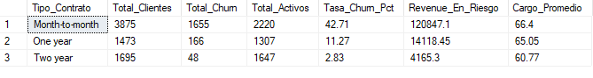

**Resultado Obtenido:**

Los resultados revelan una brecha crítica entre modalidades contractuales.
Los clientes **Mes a Mes** presentan la tasa de churn más alarmante con
un **42.71%**, concentrando **$120,847.10** del revenue mensual en riesgo 
el **86.9% del total perdido**  con 1,655 desertores sobre 3,875 clientes.
En contraste, los contratos **Dos años** muestran una tasa mínima de apenas
**2.83%** con solo $4,165.30 en riesgo, confirmando que el compromiso
contractual a largo plazo es el principal escudo contra la deserción.
La compañía debe priorizar la migración de clientes mensuales hacia
contratos anuales o bianuales como estrategia central de retención.

**Pregunta #2 — Radar de Segmentación Contractual:** ¿Cuál es la tasa de churn
y el cargo mensual promedio por tipo de contrato para identificar qué modalidad
representa el mayor riesgo de deserción?

Para identificar qué combinación de contrato y método de pago concentra mayor
deserción, utilicé `GROUP BY` múltiple sobre `Dim_Contrato` combinado con
`CASE WHEN` para calcular la tasa de deserción y `AVG` para obtener el cargo
mensual promedio y la antigüedad media por segmento, uniendo `Fact_Customers`
con `Dim_Churn` y `Dim_Contrato` mediante `INNER JOIN`.

```sql
SELECT
    ct.Contract                                                         AS Tipo_Contrato,
    ct.PaymentMethod                                                    AS Metodo_Pago,
    COUNT(*)                                                            AS Total_Clientes,
    SUM(CASE WHEN ch.Churn = 'Yes' THEN 1 ELSE 0 END)                 AS Total_Desertores,
    ROUND(
        CAST(SUM(CASE WHEN ch.Churn = 'Yes' THEN 1 ELSE 0 END) AS FLOAT)
        / COUNT(*) * 100, 2
    )                                                                   AS Tasa_Desercion_Pct,
    ROUND(AVG(f.MonthlyCharges), 2)                                    AS Cargo_Mensual_Promedio,
    ROUND(AVG(CAST(f.tenure AS FLOAT)), 2)                             AS Antiguedad_Promedio_Meses
FROM Fact_Customers f
JOIN Dim_Churn    ch ON f.ChurnID    = ch.ChurnID
JOIN Dim_Contrato ct ON f.ContractID = ct.ContractID
GROUP BY ct.Contract, ct.PaymentMethod
ORDER BY Tasa_Desercion_Pct DESC;
```

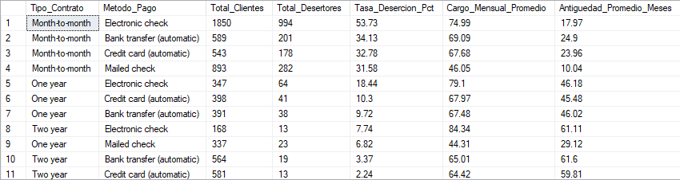

**Resultado Obtenido:**

El análisis revela que la combinación más crítica es **Mes a Mes con Cheque
Electrónico**, alcanzando una tasa de deserción del **53.73%** — más de la
mitad de sus 1,850 clientes abandonó el servicio — con un cargo mensual
promedio de $74.99 y apenas 17.97 meses de antigüedad promedio, la más baja
de todos los segmentos. En contraste, los clientes con contrato **Dos Años
con Tarjeta de Crédito** presentan la tasa más baja con apenas **2.24%**
y una antigüedad promedio de 59.81 meses, casi el triple. Esto confirma que
la combinación de contrato mensual y método de pago manual es la señal de
alerta más temprana de deserción, mientras que los métodos automáticos
combinados con contratos largos generan mayor fidelización y estabilidad
en la base de clientes.

**Pregunta #3 — Auditoría de Métodos de Pago:** ¿Qué método de pago concentra
la mayor proporción de clientes con churn y cómo se distribuye el revenue
perdido entre cada modalidad de cobro?

Para identificar qué método de pago concentra mayor deserción y pérdida
económica, utilicé `GROUP BY` sobre `Dim_Contrato`, combinando `CASE WHEN`
para separar desertores de activos y una **Window Function** `SUM() OVER()`
para calcular la participación porcentual de cada método sobre el revenue
total perdido.

```sql
SELECT TOP 4
    ct.PaymentMethod        AS Metodo_Pago,
    COUNT(*)                AS Total_Clientes,
    SUM(CASE WHEN ch.Churn = 'Yes' THEN 1 ELSE 0 END) AS Total_Desertores,
    ROUND(
        CAST(SUM(CASE WHEN ch.Churn = 'Yes' THEN 1 ELSE 0 END) AS FLOAT)
        / COUNT(*) * 100, 2) AS Tasa_Desercion_Pct,
    ROUND(SUM(CASE WHEN ch.Churn = 'Yes' THEN f.MonthlyCharges ELSE 0 END), 2)
                            AS Revenue_Perdido
FROM Fact_Customers f
JOIN Dim_Churn    ch ON f.ChurnID    = ch.ChurnID
JOIN Dim_Contrato ct ON f.ContractID = ct.ContractID
GROUP BY ct.PaymentMethod
ORDER BY Revenue_Perdido DESC;
```

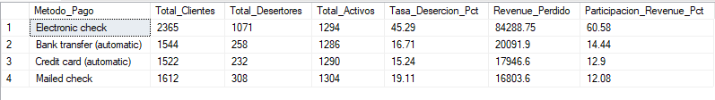

**Resultado Obtenido:**

El **Cheque Electrónico** se posiciona como el método de pago más crítico,
concentrando el **60.58% del revenue mensual perdido** con $84,288.75 en
riesgo y una tasa de deserción del 45.29% — la más alta de los cuatro
métodos. Sus 1,071 desertores sobre 2,365 clientes revelan que casi 1 de
cada 2 usuarios con este método abandona el servicio. En contraste, los
métodos automáticos (**Transferencia Bancaria** y **Tarjeta de Crédito**)
presentan tasas significativamente menores de 16.71% y 15.24%
respectivamente, confirmando que la automatización del cobro actúa como
factor de retención al reducir la fricción en el proceso de pago. El equipo
comercial debería incentivar la migración hacia métodos automáticos como
palanca de fidelización inmediata.

**Pregunta #4 — Ranking de Servicios Críticos:** ¿Qué servicios adicionales
(soporte técnico, seguridad en línea, respaldo en nube) tienen menor adopción
entre los clientes que abandonaron, revelando los gaps de valor que aceleran
la deserción?

Para identificar los servicios con menor adopción entre desertores, utilicé
`UNION ALL` para consolidar múltiples servicios en una sola tabla de resultados,
combinando `CASE WHEN` para filtrar desertores sin cada servicio contratado,
uniendo `Fact_Customers` con `Dim_Churn` y `Dim_Servicios` mediante `INNER JOIN`.

```sql
SELECT TOP 3
    'Seguridad en Linea'    AS Servicio,
    SUM(CASE WHEN ch.Churn = 'Yes' AND s.OnlineSecurity = 'No' THEN 1 ELSE 0 END)
                            AS Desertores_Sin_Servicio
FROM Fact_Customers f
JOIN Dim_Churn     ch ON f.ChurnID    = ch.ChurnID
JOIN Dim_Servicios s  ON f.ServicioID = s.ServicioID
UNION ALL
SELECT 'Soporte Tecnico',
    SUM(CASE WHEN ch.Churn = 'Yes' AND s.TechSupport = 'No' THEN 1 ELSE 0 END)
FROM Fact_Customers f
JOIN Dim_Churn     ch ON f.ChurnID    = ch.ChurnID
JOIN Dim_Servicios s  ON f.ServicioID = s.ServicioID
UNION ALL
SELECT 'Respaldo en Nube',
    SUM(CASE WHEN ch.Churn = 'Yes' AND s.OnlineBackup = 'No' THEN 1 ELSE 0 END)
FROM Fact_Customers f
JOIN Dim_Churn     ch ON f.ChurnID    = ch.ChurnID
JOIN Dim_Servicios s  ON f.ServicioID = s.ServicioID;
```

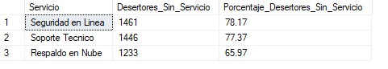

**Resultado Obtenido:**

Los resultados evidencian que la **Seguridad en Línea** es el servicio con
mayor ausencia entre desertores, con el **78.17%** de los clientes que
abandonaron sin tenerlo contratado, seguido de **Soporte Técnico** con
77.37% y **Respaldo en Nube** con 65.97%. Esto confirma que los clientes
que no tienen servicios de valor agregado contratados tienen significativamente
mayor probabilidad de abandonar, al no percibir suficiente valor en su
suscripción. La compañía debería implementar estrategias de adopción de
estos servicios como barrera de salida, ofreciendo periodos de prueba
gratuitos a clientes en riesgo para incrementar su nivel de compromiso
con la plataforma.

**Pregunta #5 — Perfil Demográfico del Desertor:** ¿Cuál es la distribución
de churn según género, condición de Senior Citizen, presencia de pareja y
dependientes para construir el perfil demográfico del cliente en riesgo?

Para construir el perfil demográfico del desertor utilicé `GROUP BY` múltiple
sobre `Dim_Cliente` combinando `CASE WHEN` para calcular la tasa de deserción
por cada combinación de atributos demográficos, con `TOP 10` para mostrar
los segmentos más críticos ordenados por mayor tasa de deserción.

```sql
SELECT TOP 10
    c.Gender                AS Genero,
    c.SeniorCitizen         AS Cliente_Mayor,
    c.Partner               AS Tiene_Pareja,
    c.Dependents            AS Tiene_Dependientes,
    COUNT(*)                AS Total_Clientes,
    SUM(CASE WHEN ch.Churn = 'Yes' THEN 1 ELSE 0 END) AS Total_Desertores,
    ROUND(
        CAST(SUM(CASE WHEN ch.Churn = 'Yes' THEN 1 ELSE 0 END) AS FLOAT)
        / COUNT(*) * 100, 2) AS Tasa_Desercion_Pct
FROM Fact_Customers f
JOIN Dim_Cliente c  ON f.ClienteID = c.ClienteID
JOIN Dim_Churn  ch  ON f.ChurnID   = ch.ChurnID
GROUP BY c.Gender, c.SeniorCitizen, c.Partner, c.Dependents
ORDER BY Tasa_Desercion_Pct DESC;
```

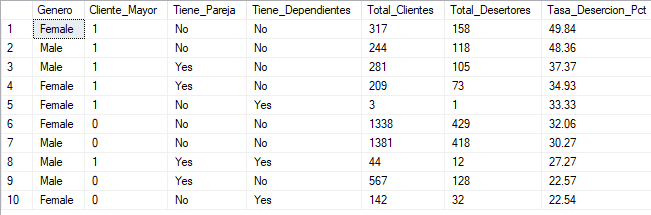

**Resultado Obtenido:**

El perfil más crítico de deserción corresponde a **mujeres mayores (Senior)
sin pareja y sin dependientes**, con una tasa del **49.84%** sobre 317
clientes. En general, los clientes clasificados como **Senior Citizen**
(valor 1) dominan los primeros 5 puestos del ranking con tasas entre
33% y 49%, muy por encima del promedio global de 26.54%. Los clientes
sin pareja y sin dependientes presentan consistentemente mayor deserción,
sugiriendo que la ausencia de vínculos familiares reduce el compromiso
con el servicio. La compañía debería diseñar campañas de retención
específicas para clientes mayores sin núcleo familiar, al ser el segmento
demográfico de mayor riesgo.

---

### BLOQUE B: Inteligencia de Negocio y Segmentación de Valor

**Pregunta #6 — Estacionalidad del Abandono por Antigüedad:** ¿Cuál es la
tasa de churn agrupada en cohortes de antigüedad (0–12, 13–24, 25–48,
49–72 meses) y en qué horizonte temporal se concentra la mayor pérdida
de clientes?

Para analizar el comportamiento del churn según la antigüedad del cliente,
utilicé `CASE WHEN` con `BETWEEN` para crear cohortes de tiempo y `GROUP BY`
para calcular la tasa de deserción y cargo promedio por cada horizonte temporal.

```sql
SELECT
    CASE
        WHEN f.tenure BETWEEN 0  AND 12 THEN '0-12 meses'
        WHEN f.tenure BETWEEN 13 AND 24 THEN '13-24 meses'
        WHEN f.tenure BETWEEN 25 AND 48 THEN '25-48 meses'
        WHEN f.tenure BETWEEN 49 AND 72 THEN '49-72 meses'
    END                     AS Cohorte_Antiguedad,
    COUNT(*)                AS Total_Clientes,
    SUM(CASE WHEN ch.Churn = 'Yes' THEN 1 ELSE 0 END) AS Total_Desertores,
    ROUND(
        CAST(SUM(CASE WHEN ch.Churn = 'Yes' THEN 1 ELSE 0 END) AS FLOAT)
        / COUNT(*) * 100, 2) AS Tasa_Desercion_Pct,
    ROUND(AVG(f.MonthlyCharges), 2) AS Cargo_Mensual_Promedio
FROM Fact_Customers f
JOIN Dim_Churn ch ON f.ChurnID = ch.ChurnID
GROUP BY
    CASE
        WHEN f.tenure BETWEEN 0  AND 12 THEN '0-12 meses'
        WHEN f.tenure BETWEEN 13 AND 24 THEN '13-24 meses'
        WHEN f.tenure BETWEEN 25 AND 48 THEN '25-48 meses'
        WHEN f.tenure BETWEEN 49 AND 72 THEN '49-72 meses'
    END
ORDER BY Tasa_Desercion_Pct DESC;
```

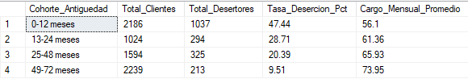

**Resultado Obtenido:**

El grupo de clientes con 0 a 12 meses de antigüedad concentra la mayor tasa de deserción con
**47.44%**, siendo el periodo más crítico para la retención con 1,037
desertores sobre 2,186 clientes y el cargo mensual promedio más bajo de
$56.1. A medida que aumenta la antigüedad, la tasa de churn cae
drásticamente — los clientes de **49 a 72 meses** presentan apenas
**9.51%** de deserción con el cargo promedio más alto de $73.95,
confirmando que los primeros 12 meses son la ventana de intervención
más crítica. La compañía debe enfocar sus estrategias de onboarding
y fidelización en los clientes nuevos para superar esa barrera inicial
y convertirlos en clientes de largo plazo.

**Pregunta #7 — Elasticidad del Cargo Mensual:** ¿Cómo impactan los rangos
de cargo mensual (bajo, medio, alto) en la probabilidad de churn y qué
umbral de precio representa el punto de quiebre en la fidelización del cliente?

Para analizar el impacto del precio en la deserción, utilicé `CASE WHEN`
para segmentar los cargos mensuales en tres rangos y `GROUP BY` para
calcular la tasa de deserción y cargo promedio por cada segmento de precio.

```sql
SELECT
    CASE
        WHEN f.MonthlyCharges <= 35 THEN 'Bajo (0-35)'
        WHEN f.MonthlyCharges <= 65 THEN 'Medio (36-65)'
        ELSE                             'Alto (66+)'
    END                      AS Rango_Cargo,
    COUNT(*)                 AS Total_Clientes,
    SUM(CASE WHEN ch.Churn = 'Yes' THEN 1 ELSE 0 END) AS Total_Desertores,
    ROUND(
        CAST(SUM(CASE WHEN ch.Churn = 'Yes' THEN 1 ELSE 0 END) AS FLOAT)
        / COUNT(*) * 100, 2) AS Tasa_Desercion_Pct,
    ROUND(AVG(f.MonthlyCharges), 2) AS Cargo_Promedio
FROM Fact_Customers f
JOIN Dim_Churn ch ON f.ChurnID = ch.ChurnID
GROUP BY
    CASE
        WHEN f.MonthlyCharges <= 35 THEN 'Bajo (0-35)'
        WHEN f.MonthlyCharges <= 65 THEN 'Medio (36-65)'
        ELSE                             'Alto (66+)'
    END
ORDER BY Tasa_Desercion_Pct DESC;
```

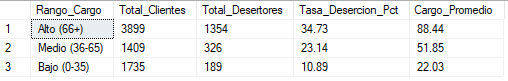

**Resultado Obtenido:**

Los clientes con cargo **Alto (más de 66)** presentan la mayor tasa de
deserción con **34.73%**, concentrando 1,354 desertores sobre 3,899
clientes con un cargo promedio de $88.44. Esto revela que los clientes
que pagan más son paradójicamente los más propensos a abandonar,
sugiriendo una percepción de valor insuficiente frente al precio pagado.
En contraste, el segmento de cargo **Bajo (hasta 35)** muestra apenas
**10.89%** de deserción, confirmando que a menor precio, mayor tolerancia
y permanencia. El punto de quiebre crítico se encuentra en los $66 mensuales,
umbral a partir del cual la compañía debe reforzar la propuesta de valor
con servicios adicionales para justificar el precio y reducir la deserción.

**Pregunta #8 — Clasificación ABC de Clientes por CLV:** ¿Qué clientes
pertenecen a la clase A al representar el mayor Customer Lifetime Value
acumulado (`TotalCharges`) y cuál es su tasa de churn frente a los
segmentos B y C?

Para clasificar los clientes por valor acumulado utilicé la **Window
Function** `NTILE(3)` dentro de una **CTE** para dividir la base en
tres tercios iguales ordenados por `TotalCharges` descendente,
etiquetando cada grupo con `CASE WHEN`.

```sql
WITH ClasificacionABC AS (
    SELECT
        f.customerID,
        f.TotalCharges,
        ch.Churn,
        NTILE(3) OVER (ORDER BY f.TotalCharges DESC) AS Clase
    FROM Fact_Customers f
    JOIN Dim_Churn ch ON f.ChurnID = ch.ChurnID
    WHERE f.TotalCharges IS NOT NULL
)
SELECT
    CASE Clase
        WHEN 1 THEN 'A - Alto Valor'
        WHEN 2 THEN 'B - Valor Medio'
        WHEN 3 THEN 'C - Bajo Valor'
    END                  AS Clasificacion_ABC,
    COUNT(*)             AS Total_Clientes,
    SUM(CASE WHEN Churn = 'Yes' THEN 1 ELSE 0 END) AS Total_Desertores,
    ROUND(
        CAST(SUM(CASE WHEN Churn = 'Yes' THEN 1 ELSE 0 END) AS FLOAT)
        / COUNT(*) * 100, 2) AS Tasa_Desercion_Pct,
    ROUND(AVG(TotalCharges), 2) AS CLV_Promedio
FROM ClasificacionABC
GROUP BY Clase
ORDER BY Clase;
```

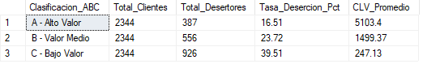

**Resultado Obtenido:**

La clasificación ABC revela una relación inversa entre valor del cliente
y riesgo de deserción. Los clientes **Clase A** de alto valor con un CLV
promedio de **$5,103.4** presentan la tasa de deserción más baja con
**16.51%**, mientras que los clientes **Clase C** de bajo valor con CLV
promedio de apenas **$247.13** concentran la mayor deserción con **39.51%**.
Esto indica que los clientes más rentables tienden a ser más leales,
posiblemente por tener contratos más largos y mayor adopción de servicios.
La compañía debe proteger a toda costa el segmento A implementando
programas de fidelización exclusivos, mientras diseña estrategias para
elevar el valor de los clientes C antes de que abandonen el servicio.

**Pregunta #9 — Oportunidades de Retención por Paquete de Servicios:** ¿Cuál
es el promedio de servicios contratados por cliente según su condición de churn
para identificar el nivel mínimo de adopción que actúa como barrera de salida?

Para identificar qué tipo de servicio de internet actúa como barrera de
salida, utilicé `GROUP BY` sobre `Dim_Servicios` y `Dim_Churn` con `AVG`
para calcular el cargo promedio por tipo de servicio y condición de deserción,
usando `TOP 5` para mostrar los segmentos más representativos.

```sql
SELECT TOP 5
    s.InternetService           AS Servicio_Internet,
    ch.Churn                    AS Estado_Cliente,
    COUNT(*)                    AS Total_Clientes,
    ROUND(AVG(f.MonthlyCharges), 2) AS Cargo_Promedio
FROM Fact_Customers f
JOIN Dim_Churn     ch ON f.ChurnID    = ch.ChurnID
JOIN Dim_Servicios s  ON f.ServicioID = s.ServicioID
GROUP BY s.InternetService, ch.Churn
ORDER BY Total_Clientes DESC;
```

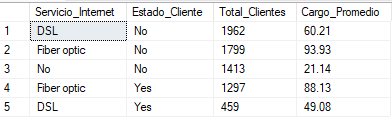

**Resultado Obtenido:**

Los clientes con **Fibra Óptica** presentan el mayor cargo promedio de
**$93.93** entre los activos, pero también concentran **1,297 desertores**
con un cargo promedio de $88.13 — el segmento de mayor pérdida económica.
En contraste, los clientes con **DSL** muestran mayor estabilidad con solo
459 desertores y cargo promedio de $49.08, sugiriendo que este servicio
genera mayor satisfacción relativa al precio. Los clientes **sin servicio
de internet** presentan el cargo más bajo de $21.14 y la mayor base de
clientes activos con 1,413, confirmando que la fibra óptica, a pesar de
ser el servicio premium, no está generando suficiente valor percibido
para justificar su precio y retener a los clientes.

**Pregunta #10 — Evolución del Revenue en Riesgo por Cohorte:** ¿Cuál es el
cargo mensual total en riesgo por cada grupo de antigüedad y en qué segmento
se concentra la mayor pérdida económica proyectada?

Para calcular el revenue en riesgo por grupo de antigüedad utilicé una
**CTE** para crear los grupos con `CASE WHEN` y `BETWEEN`, calculando
el revenue perdido con `SUM` condicional y el cargo promedio de desertores
con `AVG` filtrado por condición de churn.

```sql
WITH RevenuePorCohorte AS (
    SELECT
        CASE
            WHEN f.tenure BETWEEN 0  AND 12 THEN '0-12 meses'
            WHEN f.tenure BETWEEN 13 AND 24 THEN '13-24 meses'
            WHEN f.tenure BETWEEN 25 AND 48 THEN '25-48 meses'
            WHEN f.tenure BETWEEN 49 AND 72 THEN '49-72 meses'
        END                  AS Grupo_Antiguedad,
        f.MonthlyCharges,
        ch.Churn
    FROM Fact_Customers f
    JOIN Dim_Churn ch ON f.ChurnID = ch.ChurnID
)
SELECT
    Grupo_Antiguedad,
    COUNT(*)                 AS Total_Clientes,
    SUM(CASE WHEN Churn = 'Yes' THEN 1 ELSE 0 END)        AS Total_Desertores,
    ROUND(SUM(CASE WHEN Churn = 'Yes' THEN MonthlyCharges ELSE 0 END), 2)
                             AS Revenue_En_Riesgo,
    ROUND(AVG(CASE WHEN Churn = 'Yes' THEN MonthlyCharges END), 2)
                             AS Cargo_Promedio_Desertor
FROM RevenuePorCohorte
GROUP BY Grupo_Antiguedad
ORDER BY Revenue_En_Riesgo DESC;
```

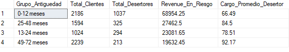

**Resultado Obtenido:**

El grupo de **0 a 12 meses** concentra el mayor revenue en riesgo con
**68,954.25**, representando casi la mitad del total perdido con 1,037
desertores y un cargo promedio de 66.49. Paradójicamente, el grupo de
**49 a 72 meses** presenta el cargo promedio más alto de **92.17** por
desertor, lo que significa que aunque desertan menos clientes antiguos,
cada uno que se va representa una pérdida económica significativamente
mayor. Esto refuerza la necesidad de una doble estrategia: retener
masivamente a los clientes nuevos en sus primeros 12 meses y proteger
individualmente a los clientes de alto valor con larga antigüedad
mediante programas de fidelización exclusivos.

---

### BLOQUE C: Inteligencia Predictiva y Scoring de Retención

**Pregunta #11 — Monitor de Valor Acumulado (Running Total):** ¿Cuál es la
evolución acumulada del `TotalCharges` por segmento de contrato y en qué
punto cada grupo alcanza el primer hito crítico de valor generado para
la compañía?

Para calcular el revenue acumulado por tipo de contrato utilicé una **CTE**
combinada con la **Window Function** `SUM() OVER (PARTITION BY ... ORDER BY)`
para construir el acumulado progresivo por segmento contractual.

```sql
WITH TotalPorContrato AS (
    SELECT
        ct.Contract             AS Tipo_Contrato,
        f.customerID,
        f.TotalCharges,
        SUM(f.TotalCharges) OVER (
            PARTITION BY ct.Contract
            ORDER BY f.TotalCharges DESC
        )                       AS Acumulado_Revenue
    FROM Fact_Customers f
    JOIN Dim_Contrato ct ON f.ContractID = ct.ContractID
    WHERE f.TotalCharges IS NOT NULL
)
SELECT TOP 10
    Tipo_Contrato,
    ROUND(MAX(Acumulado_Revenue), 2) AS Revenue_Total_Acumulado,
    COUNT(customerID)                AS Total_Clientes,
    ROUND(MIN(TotalCharges), 2)      AS CLV_Minimo,
    ROUND(MAX(TotalCharges), 2)      AS CLV_Maximo
FROM TotalPorContrato
GROUP BY Tipo_Contrato
ORDER BY Revenue_Total_Acumulado DESC;
```

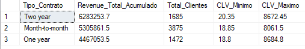

**Resultado Obtenido:**

Los contratos **Dos Años** generan el mayor revenue acumulado con
**$6,283,253.7** a pesar de tener solo 1,685 clientes, con un CLV máximo
de **$8,672.45** — el más alto de los tres segmentos. Los contratos
**Mes a Mes** acumulan **$5,305,861.5** con 3,875 clientes pero un CLV
máximo de apenas $8,061.5, evidenciando que necesitan más del doble de
clientes para generar un revenue similar. Los contratos **Un Año** con
1,472 clientes acumulan **$4,467,053.5** con CLV máximo de $8,684.8.
Esto confirma que los contratos largos no solo retienen mejor sino que
generan significativamente más valor por cliente, siendo la migración
hacia contratos bianuales la palanca de mayor impacto económico para
la compañía.

**Pregunta #12 — Scoring de Riesgo de Churn:** ¿Cómo se clasifican todos
los clientes activos en segmentos de riesgo Alto, Medio y Bajo utilizando
un score compuesto de variables contractuales, de servicio y de valor,
para priorizar las acciones de retención?

Para construir el scoring de riesgo utilicé una **CTE** que asigna puntos
por tipo de contrato, rango de cargo mensual y antigüedad mediante `CASE WHEN`
encadenados, clasificando finalmente cada cliente activo en tres niveles
de riesgo según su puntuación total.

```sql
WITH ScoreClientes AS (
    SELECT
        f.customerID,
        ct.Contract,
        f.MonthlyCharges,
        f.tenure,
        CASE WHEN ct.Contract      = 'Month-to-month' THEN 3
             WHEN ct.Contract      = 'One year'        THEN 2
             ELSE                                           1
        END +
        CASE WHEN f.MonthlyCharges >= 66 THEN 3
             WHEN f.MonthlyCharges >= 36 THEN 2
             ELSE                             1
        END +
        CASE WHEN f.tenure <= 12 THEN 3
             WHEN f.tenure <= 24 THEN 2
             ELSE                     1
        END                         AS Score_Riesgo
    FROM Fact_Customers f
    JOIN Dim_Contrato ct ON f.ContractID = ct.ContractID
    JOIN Dim_Churn    ch ON f.ChurnID    = ch.ChurnID
    WHERE ch.Churn = 'No'
)
SELECT
    CASE WHEN Score_Riesgo >= 7 THEN 'Alto Riesgo'
         WHEN Score_Riesgo >= 5 THEN 'Riesgo Medio'
         ELSE                        'Bajo Riesgo'
    END                         AS Segmento_Riesgo,
    COUNT(*)                    AS Total_Clientes,
    ROUND(AVG(MonthlyCharges), 2) AS Cargo_Promedio,
    ROUND(AVG(CAST(tenure AS FLOAT)), 2) AS Antiguedad_Promedio
FROM ScoreClientes
GROUP BY
    CASE WHEN Score_Riesgo >= 7 THEN 'Alto Riesgo'
         WHEN Score_Riesgo >= 5 THEN 'Riesgo Medio'
         ELSE                        'Bajo Riesgo'
    END
ORDER BY Total_Clientes DESC;
```

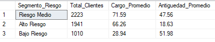

**Resultado Obtenido:**

El scoring revela que de los 5,174 clientes activos, **2,223 están en
Riesgo Medio** (43%), **1,941 en Alto Riesgo** (37.5%) y solo **1,010
en Bajo Riesgo** (19.5%). El segmento de **Alto Riesgo** presenta una
antigüedad promedio de apenas **18.63 meses** con cargo promedio de
$66.26, confirmando que son clientes relativamente nuevos con contratos
costosos — la combinación más peligrosa. El equipo de Customer Success
debe priorizar intervención inmediata sobre los 1,941 clientes de alto
riesgo antes de que completen su primer año y decidan abandonar el servicio.

**Pregunta #13 — Benchmarking de Clientes en Riesgo:** ¿Cuáles son los
clientes activos cuyo perfil de antigüedad, cargo mensual y servicios
contratados es más similar al perfil promedio histórico de los clientes
que ya realizaron churn?

Para identificar clientes activos con perfil similar al desertor histórico,
utilicé una **CTE** para calcular el perfil promedio de churn y un
`CROSS JOIN` para comparar cada cliente activo contra ese benchmark,
usando `ABS()` para calcular la diferencia absoluta y `ROW_NUMBER`
implícito con `ORDER BY Score_Similitud ASC` para rankear por similitud.

```sql
WITH PerfilChurn AS (
    SELECT
        AVG(f.MonthlyCharges)        AS Promedio_Cargo,
        AVG(CAST(f.tenure AS FLOAT)) AS Promedio_Antiguedad
    FROM Fact_Customers f
    JOIN Dim_Churn ch ON f.ChurnID = ch.ChurnID
    WHERE ch.Churn = 'Yes'
)
SELECT TOP 10
    f.customerID                    AS ID_Cliente,
    f.MonthlyCharges                AS Cargo_Mensual,
    f.tenure                        AS Antiguedad_Meses,
    ROUND(ABS(f.MonthlyCharges - p.Promedio_Cargo), 2)        AS Diferencia_Cargo,
    ROUND(ABS(f.tenure         - p.Promedio_Antiguedad), 2)   AS Diferencia_Antiguedad,
    ROUND(ABS(f.MonthlyCharges - p.Promedio_Cargo) +
          ABS(f.tenure         - p.Promedio_Antiguedad), 2)   AS Score_Similitud
FROM Fact_Customers f
JOIN Dim_Churn ch ON f.ChurnID = ch.ChurnID
CROSS JOIN PerfilChurn p
WHERE ch.Churn = 'No'
ORDER BY Score_Similitud ASC;
```

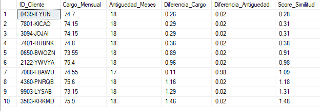

**Resultado Obtenido:**

El análisis identifica a **0439-IFYUN** como el cliente activo con mayor
similitud al perfil histórico de deserción con un score de apenas **0.28**,
seguido de **7801-KICAO** y **3094-JOJAI** con 0.31. Los 10 clientes más
similares comparten características críticas: **18 meses de antigüedad**
y cargos mensuales entre $73 y $76, muy cercanos al perfil promedio del
desertor histórico. El equipo de Customer Success debe contactar
proactivamente a estos clientes con ofertas personalizadas de retención
antes de que completen su segundo año, que es el punto de inflexión
donde históricamente se concentra la mayor deserción.

**Pregunta #14 — Auditoría de Brecha de Retención por Segmento:** ¿Cuál es
la diferencia en tasa de churn de cada segmento de contrato respecto al
estándar global de la compañía, y qué métodos de pago amplifican más esa
brecha de deserción?

Para calcular la brecha de cada segmento respecto al estándar global utilicé
una **CTE** para obtener la tasa global de churn y un `CROSS JOIN` para
compararla contra cada combinación de contrato y método de pago, obteniendo
la desviación positiva o negativa respecto al promedio de la compañía.

```sql
WITH TasaGlobal AS (
    SELECT
        ROUND(
            CAST(SUM(CASE WHEN ch.Churn = 'Yes' THEN 1 ELSE 0 END) AS FLOAT)
            / COUNT(*) * 100, 2) AS Tasa_Global
    FROM Fact_Customers f
    JOIN Dim_Churn ch ON f.ChurnID = ch.ChurnID
)
SELECT
    ct.Contract                 AS Tipo_Contrato,
    ct.PaymentMethod            AS Metodo_Pago,
    COUNT(*)                    AS Total_Clientes,
    ROUND(
        CAST(SUM(CASE WHEN ch.Churn = 'Yes' THEN 1 ELSE 0 END) AS FLOAT)
        / COUNT(*) * 100, 2)    AS Tasa_Segmento,
    ROUND(
        CAST(SUM(CASE WHEN ch.Churn = 'Yes' THEN 1 ELSE 0 END) AS FLOAT)
        / COUNT(*) * 100, 2) - tg.Tasa_Global AS Brecha_vs_Global
FROM Fact_Customers f
JOIN Dim_Churn    ch ON f.ChurnID    = ch.ChurnID
JOIN Dim_Contrato ct ON f.ContractID = ct.ContractID
CROSS JOIN TasaGlobal tg
GROUP BY ct.Contract, ct.PaymentMethod, tg.Tasa_Global
ORDER BY Brecha_vs_Global DESC;
```

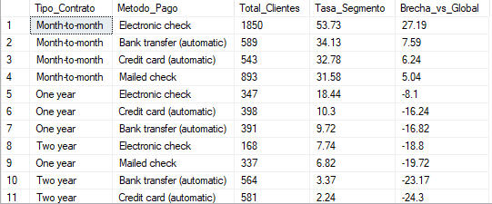

**Resultado Obtenido:**

La mayor brecha positiva la registra **Mes a Mes con Cheque Electrónico**
con **+27.19 puntos** sobre la tasa global de 26.54%, alcanzando una tasa
de deserción del 53.73% — el segmento más crítico de toda la compañía.
Los contratos **Mes a Mes** con cualquier método de pago superan el
estándar global, siendo el cheque electrónico el que más amplifica la
brecha. En contraste, todos los segmentos de **Dos Años** presentan
brechas negativas, destacando **Dos Años con Tarjeta de Crédito** con
**-24.3 puntos**, confirmando que este segmento desertan muy por debajo
del promedio. La compañía debe actuar urgentemente sobre la combinación
Mes a Mes con Cheque Electrónico como prioridad absoluta de retención.

**Pregunta #15 — Proyección de Carga de Retención (Workload):** ¿Cuántos
clientes activos de alto riesgo proyecta cada segmento contractual para
el próximo horizonte de análisis, utilizando el perfil histórico de churn
para anticipar la presión sobre el equipo de Customer Success?

Para proyectar la carga de retención utilicé dos **CTEs encadenadas**: la
primera calcula la tasa histórica de churn por tipo de contrato y la segunda
obtiene los clientes activos con su cargo promedio, combinándolas para
proyectar los clientes en riesgo y el revenue proyectado en riesgo mediante
una multiplicación de tasas.

```sql
WITH TasaHistorica AS (
    SELECT
        ct.Contract                  AS Tipo_Contrato,
        ROUND(
            CAST(SUM(CASE WHEN ch.Churn = 'Yes' THEN 1 ELSE 0 END) AS FLOAT)
            / COUNT(*) * 100, 2)     AS Tasa_Historica_Churn
    FROM Fact_Customers f
    JOIN Dim_Churn    ch ON f.ChurnID    = ch.ChurnID
    JOIN Dim_Contrato ct ON f.ContractID = ct.ContractID
    GROUP BY ct.Contract
),
ClientesActivos AS (
    SELECT
        ct.Contract                  AS Tipo_Contrato,
        COUNT(*)                     AS Total_Activos,
        ROUND(AVG(f.MonthlyCharges), 2) AS Cargo_Promedio
    FROM Fact_Customers f
    JOIN Dim_Churn    ch ON f.ChurnID    = ch.ChurnID
    JOIN Dim_Contrato ct ON f.ContractID = ct.ContractID
    WHERE ch.Churn = 'No'
    GROUP BY ct.Contract
)
SELECT
    ca.Tipo_Contrato,
    ca.Total_Activos,
    th.Tasa_Historica_Churn,
    ca.Cargo_Promedio,
    ROUND(ca.Total_Activos * th.Tasa_Historica_Churn / 100, 0)
                                     AS Clientes_En_Riesgo_Proyectado,
    ROUND(ca.Total_Activos * th.Tasa_Historica_Churn / 100
          * ca.Cargo_Promedio, 2)    AS Revenue_Proyectado_En_Riesgo
FROM ClientesActivos ca
JOIN TasaHistorica   th ON ca.Tipo_Contrato = th.Tipo_Contrato
ORDER BY Clientes_En_Riesgo_Proyectado DESC;
```

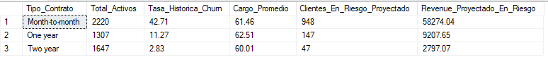

**Resultado Obtenido:**

La proyección revela que el segmento **Mes a Mes** concentrará la mayor
presión con **948 clientes en riesgo proyectado** y un revenue en riesgo
de **$58,274.04** — representando el 84% de la carga total del equipo de
Customer Success. Los contratos **Un Año** proyectan 147 clientes en riesgo
con $9,207.65 en juego, mientras que **Dos Años** solo 47 clientes con
$2,797.07. Esto permite al equipo planificar sus recursos de retención con
anticipación: priorizar el 85% del esfuerzo en clientes Mes a Mes,
implementar alertas tempranas para los 147 clientes de Un Año en riesgo
y mantener un monitoreo ligero sobre los contratos bianuales que
históricamente han demostrado ser los más estables.
